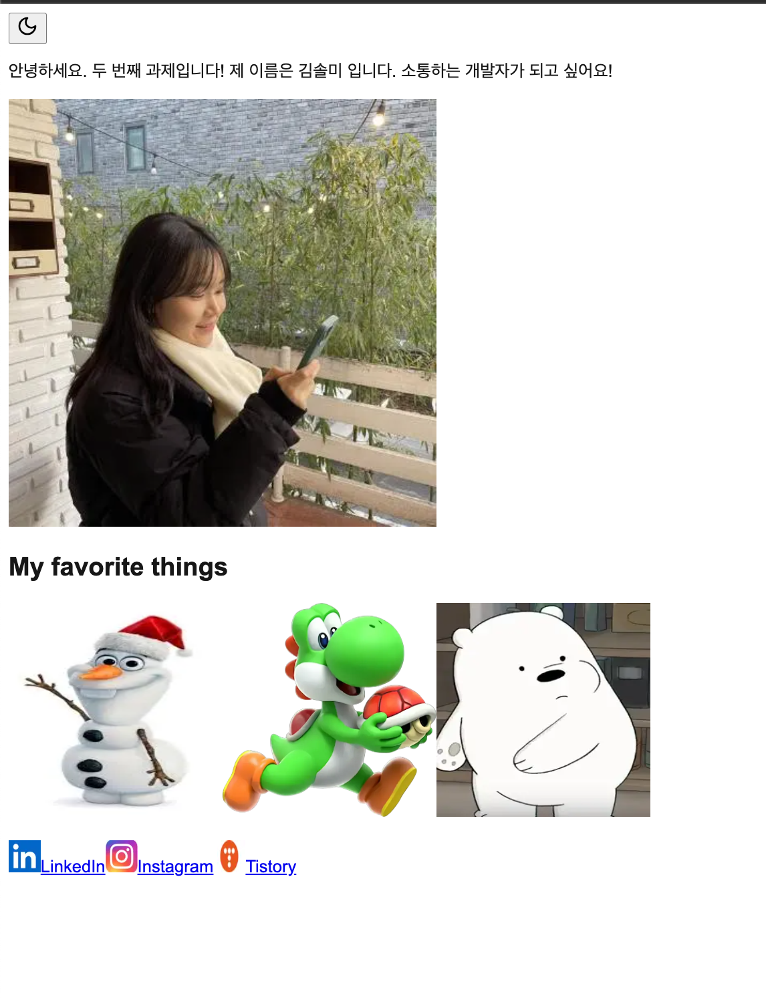

##🌟 PARD 5기 웹파트 OT 과제 🌟
#📌 프로젝트 개요
자기소개 페이지를 제작하여 배포하는 프로젝트입니다.
Next.js를 활용하여 개인 포트폴리오 형태의 소개 페이지를 만들고,
Netlify를 통해 배포하여 누구나 볼 수 있도록 공유합니다. 🚀

#🎯 서비스 소개
본 프로젝트에서는 다음과 같은 내용을 담고 있습니다:
✅ 자기소개: 간단한 인적 사항 및 목표
✅ 좋아하는 것: 나를 표현하는 3가지 키워드
✅ 반응형 UI: 모바일 & 다크모드 지원

