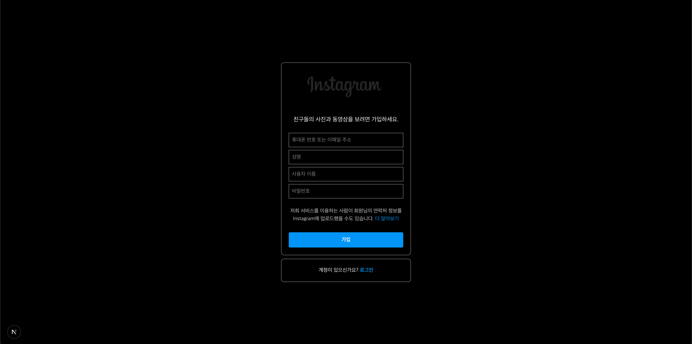

열심히 하고있는중..!! 

아쉬운 부분 & 보완해야하는 부분 
- 아이콘
- 사이드 바 컴포넌트화 

스타일 적용 
- style module css 로 적용 (다음에는 tailwind로 할 예정-> 반응형 매우 쉬움)

전체적인 파일 구조는 다음과 같다.

RegisterPage 실행결과

MyPage 실행결과

시간이 많았으면 챌린지 미션도 해보는데,
다음에 도전해서 업데이트 후 푸쉬해야겠다.

